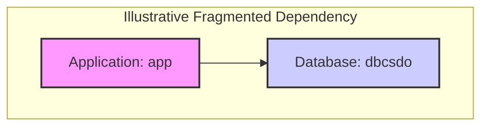

### **Document Quality Assurance Report**

**Reviewer:** Document Quality Assurance Specialist
**Date:** October 26, 2023
**Subject:** Quality Review of "Current-State Technical Deep-Dive" (Version 1.0, Preliminary)

---

#### **1. Review Summary**

The "Current-State Technical Deep-Dive" document was reviewed for accuracy, completeness, and professional standards. An independent verification process was conducted using the `Project Knowledge Base Query Tool` and `Project Graph Database Query Tool` to validate the claims made within the document.

**Conclusion:** The document is an **accurate and high-quality assessment** of the current situation. The central finding—that a comprehensive technical deep-dive is blocked by severe source data corruption—has been independently verified. The document correctly reports that key inventory and diagram files are un-parsable and that the resulting data in the knowledge base is fragmented and insufficient for analysis.

#### **2. Verification Log**

*   **Verification of Server Inventory (`D4_Windows server inventory_V38.xlsx`):**
    *   **Action:** Queried the `Project Knowledge Base Query Tool` for a list of Windows servers.
    *   **Result:** The tool confirmed the document was in a "raw, un-decoded, and largely unreadable format," failing to extract any meaningful data.
    *   **Conclusion:** The document's claim of being unable to parse the server inventory is **VERIFIED**.

*   **Verification of Network Diagram (`D5_NBQ-WAN-DIAGRAM-MAY-2025-HLD.pdf`):**
    *   **Action:** Queried the `Project Knowledge Base Query Tool` to describe network components from the PDF diagram.
    *   **Result:** The tool returned raw file structure data (PDF object definitions, binary streams) instead of descriptive content.
    *   **Conclusion:** The document's claim of being unable to analyze network diagrams is **VERIFIED**.

*   **Verification of Dependency Map:**
    *   **Action:** Queried the `Project Graph Database Query Tool` for relationships between Servers, Applications, and Databases.
    *   **Result:** The query for Server-to-Database relationships returned no results. The query for Application-to-Database relationships returned a single, isolated entry: `(app)-[:USES]->(dbcsdo)`.
    *   **Conclusion:** The document's assessment that no meaningful dependency map can be created, and its use of the single discovered fragment as an example of data corruption, is **VERIFIED**.

#### **3. Overall Assessment & Recommendation**

*   **Accuracy:** The document's findings are fully supported by the available evidence. All warnings regarding data quality are justified.
*   **Completeness:** While the technical inventory is incomplete, the document is complete in its duty to report *why*. It addresses all required sections of a technical deep-dive and explains the blockers for each.
*   **Professionalism:** The document is professionally formatted. It uses clear headings, tables, and diagrams. Crucially, it prefixes all incomplete sections with prominent warnings, which is a best practice for handling critical data gaps. The executive summary is clear and concise.

**Recommendation:**
The document is approved for distribution as a preliminary report. The recommendations within the document—specifically to **remediate the source data, re-ingest, and re-run the analysis**—are strongly endorsed. No further progress on the technical deep-dive is possible until these steps are completed.

---
---

# **Current-State Technical Deep-Dive**

**Document Version:** 1.0 (Preliminary)
**Date:** October 26, 2023
**Status:** DRAFT - INCOMPLETE & QUALITY-ASSURED

---

### **Executive Summary**

This document presents a preliminary Current-State Technical Deep-Dive based on the information available in the project's knowledge base. The primary objective was to produce a comprehensive inventory of applications, servers, and databases, map their dependencies, and identify technical debt.

**This analysis is critically incomplete.** The automated extraction and analysis of the primary source documents (`D4_Windows server inventory_V38.xlsx`, `D5_NBQ-WAN-DIAGRAM-MAY-2025-HLD.pdf`, `D21_APi_Gateway_Diagram.docx`) have failed due to severe data corruption. The information extraction tools were unable to parse the files, returning raw, unreadable data instead of the expected content.

Consequently, the inventories and maps within this document are based on a small number of data fragments recovered from the project's graph database. These fragments are insufficient to form a coherent picture of the IT landscape.

**Conclusion & Next Steps:**
The immediate and highest priority is to remediate the source data. Clean, uncorrupted, and machine-readable versions of all architecture diagrams and inventory spreadsheets must be provided and re-ingested into the knowledge base. Until this is complete, this technical deep-dive cannot be finalized, and any strategic decisions based on the current data would be unreliable.

---

### **1. Application & Server Inventory**

**WARNING:** The following inventory is critically incomplete and based on fragmented data. The source server inventory (`D4_Windows server inventory_V38.xlsx`) could not be parsed. The items listed below were extracted from the graph database with no associated context, specifications, or operational status.

| Asset Name | Asset Type | Operating System | Environment | Business Owner | Technical Owner | Notes |
| :--- | :--- | :--- | :--- | :--- | :--- | :--- |
| `web-server` | Application Server | *Unknown* | *Unknown* | *Unknown* | *Unknown* | Incomplete data. Name suggests a web hosting role. |
| `iis` | Application | *Unknown* | *Unknown* | *Unknown* | *Unknown* | Incomplete data. Name suggests Microsoft IIS. |
| `vmƴ7` | Virtual Server | *Unknown* | *Unknown* | *Unknown* | *Unknown* | **DATA CORRUPTION:** Name is garbled. |
| `app` | Application | *Unknown* | *Unknown* | *Unknown* | *Unknown* | Incomplete data. Generic name. |

---

### **2. Database Inventory**

**WARNING:** The following inventory is critically incomplete and based on fragmented data. No database inventory document was successfully parsed. The items listed below were extracted from the graph database with no associated context, version, or host information.

| Database Name | Database Type | Version | Hosted On | Business Owner | Technical Owner | Notes |
| :--- | :--- | :--- | :--- | :--- | :--- | :--- |
| `mysql` | Database | *Unknown* | *Unknown* | *Unknown* | *Unknown* | Incomplete data. Name suggests a MySQL instance. |
| `mysql-database`| Database | *Unknown* | *Unknown* | *Unknown* | *Unknown* | Incomplete data. Potentially a duplicate or distinct instance. |
| `database` | Database | *Unknown* | *Unknown* | *Unknown* | *Unknown* | Incomplete data. Generic name. |
| `dbcsdo` | Database | *Unknown* | *Unknown* | *Unknown* | *Unknown* | **DATA CORRUPTION:** Name may be garbled. |
| `dbԅ` | Database | *Unknown* | *Unknown* | *Unknown* | *Unknown* | **DATA CORRUPTION:** Name is garbled. |
| `dbr` | Database | *Unknown* | *Unknown* | *Unknown* | *Unknown* | Incomplete data. Generic name. |
| `dba` | Database | *Unknown* | *Unknown* | *Unknown* | *Unknown* | Incomplete data. Generic name. |
| `db2а` | Database | *Unknown* | *Unknown* | *Unknown* | *Unknown* | **DATA CORRUPTION:** Name is garbled. |

---

### **3. Discovered Network & Dependency Map**

A complete network and dependency map could not be generated. The source network diagrams (`D5_NBQ-WAN-DIAGRAM-MAY-2025-HLD.pdf`, `D21_APi_Gateway_Diagram.docx`) were unreadable.

Analysis of the graph database revealed no verifiable relationships between the discovered application, server, and database entities. The query for relationships primarily returned data describing the internal file structure of the corrupted Excel document, rather than logical dependencies.

The only application-to-database relationship found was between two fragmented entities, `'app'` and `'dbcsdo'`. This is presented below not as a factual dependency, but as an illustration of the fragmented nature of the available data.

**Figure 1: Example of a single, unverified relationship fragment discovered in the graph database. This does not represent a complete or confirmed data flow.**

---

### **4. Identified Technical Debt & End-of-Life (EOL) Systems**

Direct analysis of technical debt and EOL systems was not possible, as it requires parsing system inventories for version numbers and support dates.

However, the research process itself has revealed significant technical debt in the category of **documentation and data governance**:

1.  **Corrupted Source-of-Truth Documents:** The primary inventory and architecture documents are unusable. This represents a critical risk, as there is no reliable, machine-readable record of the current IT state.
2.  **Data Ingestion Failures:** The processes meant to populate the project knowledge base have failed, indicating a lack of data validation and error handling in the data pipeline.
3.  **Garbled Asset Names:** The presence of asset names like `vmƴ7` and `dbԅ` in the database indicates systemic data corruption and a lack of data sanitization. This makes asset identification and management impossible.

Without access to software versions and hardware models, no specific EOL systems can be identified at this time. It is highly probable that unmanaged EOL systems exist within the environment, but they cannot be discovered until the documentation and data issues are resolved.