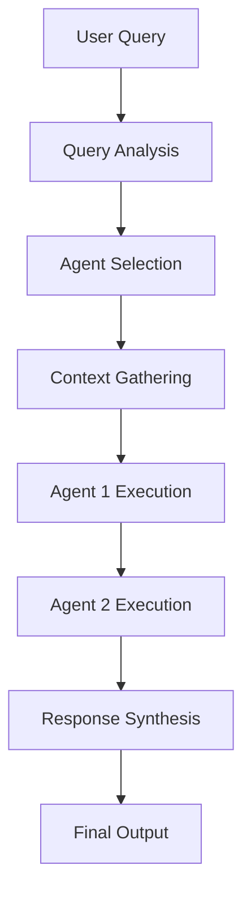
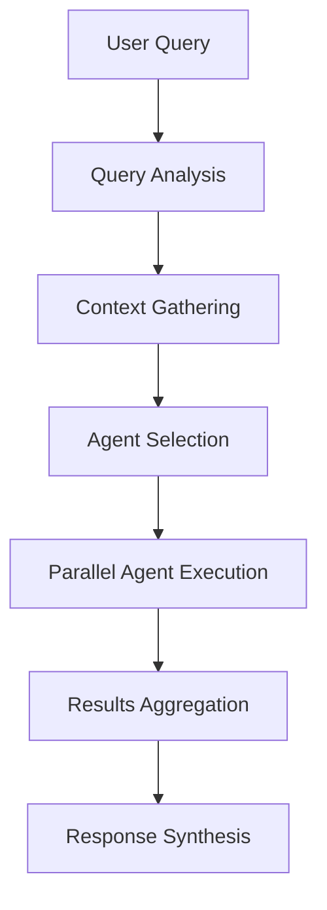

# AI Agent Service Architecture

## Overview

The AI Agent Service is a sophisticated multi-agent orchestration platform that powers intelligent cloud migration assistance through CrewAI workflows and AutoGen conversational agents. Running on port 8008, it provides both deterministic document generation capabilities and interactive AI assistance for complex migration scenarios.

The service implements a two-stage knowledge architecture:
- **Stage 1 (Foundational Facts)**: Curated discoveries extracted from documents via structured processing
- **Stage 2 (Insights Synthesis)**: Higher-level analysis and recommendations built on top of Stage 1 facts

## Tech Stack

### Core Framework
- **FastAPI**: High-performance async web framework for API endpoints
- **Uvicorn**: ASGI server for production deployment with auto-reload in development
- **Python 3.9+**: Core runtime environment

### AI Agent Frameworks
- **CrewAI**: Multi-agent workflow orchestration for deterministic tasks
- **PyAutoGen 0.2.0+**: Conversational multi-agent interactions with human-in-the-loop capabilities
- **LangChain**: LLM integration and prompt management
- **OpenAI/Anthropic/Gemini**: Multiple LLM provider support via unified LLM Service

### Infrastructure & Storage
- **Redis (DB 4)**: Task status tracking, caching, and message queuing
- **PostgreSQL**: Project metadata, conversation persistence, and session management
- **Neo4j**: Knowledge graph operations for agent context
- **WebSockets**: Real-time streaming for agent responses with connection pooling

### Dependencies
```python
fastapi, uvicorn[standard], crewai, pyautogen>=0.2.0
langchain, langchain-openai, langchain-anthropic
redis, psycopg2-binary, neo4j, httpx, websockets
pydantic, python-multipart, requests, pyyaml
asyncio-mqtt, jinja2
```

### External Integrations
- **LLM Service (Port 8007)**: Unified LLM access across multiple providers
- **Vector Service (Port 8005)**: Semantic search across vectorized documents
- **Graph Service (Port 8006)**: Knowledge graph traversal and Cypher queries
- **Document Service (Port 8003)**: Processed document access and metadata
- **Storage Service (Port 8010)**: File storage and retrieval
- **WebSocket Gateway (Port 8009)**: Real-time event broadcasting

## Agent Inventory

### CrewAI Workflow Agents

These agents execute structured, deterministic workflows for document generation and analysis tasks using the two-stage knowledge architecture.

#### 1. Document Researcher (Senior Infrastructure Discovery Analyst)
**Purpose**: Initial project context building through cross-modal knowledge synthesis
**Capabilities**:
- Multi-source data gathering and analysis
- Dependency mapping and application portfolio analysis
- Business-IT alignment assessment
- Pattern recognition across infrastructure components

**Tools Used**: RAGQueryTool, GraphQueryTool, HybridSearchTool, ProjectKnowledgeBaseTool
**Backstory**: 8+ years in information extraction, data analysis, and technical writing
**LLM Integration**: Supports project-scoped and process-specific LLM configurations

#### 2. Content Architect (Content Architecture Specialist)
**Purpose**: Professional document structure and organization
**Capabilities**:
- Information hierarchy design
- Content flow optimization
- Professional documentation standards
- Audience-appropriate content structuring

**Tools Used**: RAGQueryTool, GraphQueryTool, ProjectKnowledgeBaseTool
**Backstory**: 10+ years in document structure, information design, and technical communication

#### 3. Quality Reviewer (Document Quality Assurance Specialist)
**Purpose**: Document quality assurance and validation
**Capabilities**:
- Accuracy and completeness verification
- Consistency checking across documents
- Professional standards compliance
- Quality improvement recommendations

**Tools Used**: RAGQueryTool, GraphQueryTool
**Backstory**: 9+ years in technical writing, quality control, and editorial review

#### 4. Engagement Analyst (Senior Infrastructure Discovery Analyst)
**Purpose**: Cross-modal synthesis using Stage 1 discoveries and Stage 2 insights
**Capabilities**:
- QueryInsightsTool for layered analysis
- RecordInsightTool for persisting valuable findings
- Summary, key_entities, and compliance_scope population

**Tools Used**: RAGQueryTool, GraphQueryTool, HybridSearchTool, ProjectKnowledgeBaseTool
**Backstory**: 12+ years in enterprise IT discovery, specializing in dependency mapping

#### 5. Principal Cloud Architect
**Purpose**: Target cloud architecture design and migration strategy
**Capabilities**:
- Cloud architecture design (AWS/Azure/GCP)
- Migration pattern analysis
- Infrastructure modernization planning
- Cost-benefit analysis for architectural decisions

**Tools Used**: RAGQueryTool, GraphQueryTool, CloudServiceCatalogTool, InfrastructureAnalysisTool
**Backstory**: 15+ years leading large-scale cloud migrations

#### 6. Risk & Compliance Officer
**Purpose**: Comprehensive compliance validation and risk assessment
**Capabilities**:
- Multi-framework compliance analysis (GDPR, SOC2, HIPAA, ISO27001)
- Security risk identification and mitigation
- Regulatory requirement mapping
- Compliance gap analysis

**Tools Used**: RAGQueryTool, GraphQueryTool, ComplianceFrameworkTool
**Backstory**: Compliance expert with multi-framework experience

#### 7. Lead Migration Program Manager
**Purpose**: Synthesis of findings into executive-ready migration plans
**Capabilities**:
- Program governance and stakeholder alignment
- Timeline estimation and resource planning
- Risk mitigation strategy development
- Change management planning

**Tools Used**: RAGQueryTool, GraphQueryTool, LessonsLearnedTool
**Backstory**: Program manager experienced in governance and change management

#### 8. Post-Processing Agent (Lessons Learned Analyst)
**Purpose**: Knowledge synthesis from document processing results
**Capabilities**:
- Pattern extraction from processing results
- Best practices identification
- Insight generation with confidence scoring
- Sensitive information anonymization

**Tools Used**: QueryInsightsTool, RecordInsightTool, GraphQueryTool
**Backstory**: 10+ years in enterprise document analysis and lessons learned capture

### AutoGen Conversational Agents

These agents provide interactive, conversational AI assistance with specialized expertise areas. Each agent is initialized with system messages defining their expertise and response patterns.

#### 1. Migration Architect
**Expertise**: Strategic cloud migration planning and architecture
**Capabilities**:
- AWS/Azure/GCP migration strategies
- Application modernization and containerization
- Infrastructure as Code (Terraform, CloudFormation)
- Database migration and data lake architecture
- Security and compliance during migration

**Response Style**: Strategic guidance with detailed architectural recommendations
**System Message**: Defines role as Senior Cloud Migration Architect with comprehensive migration expertise

#### 2. DevOps Expert
**Expertise**: Infrastructure automation and deployment
**Capabilities**:
- CI/CD pipeline design and implementation
- Kubernetes and container orchestration
- Infrastructure automation and monitoring
- Site reliability engineering (SRE) practices
- Cloud-native application deployment

**Response Style**: Practical implementation guidance with code snippets and automation scripts

#### 3. Security Expert
**Expertise**: Cloud security frameworks and compliance
**Capabilities**:
- Cloud security frameworks (AWS Well-Architected, Azure Security Center)
- Identity and Access Management (IAM) design
- Data encryption and key management
- Compliance standards (SOC 2, GDPR, HIPAA, ISO 27001)
- Security monitoring and incident response

**Response Style**: Security-first recommendations with concrete mitigation strategies

#### 4. Cost Optimizer
**Expertise**: Cloud cost analysis and optimization
**Capabilities**:
- Cloud resource rightsizing and cost analysis
- Reserved instances and savings plans optimization
- Multi-cloud cost comparison and strategy
- FinOps practices and cost governance
- Resource lifecycle management

**Response Style**: Cost-benefit analysis with quantifiable savings projections

#### 5. Data Expert
**Expertise**: Database migration and data platform architecture
**Capabilities**:
- Database migration strategies (rehost, replatform, refactor)
- Data lake and warehouse architecture
- ETL/ELT pipeline design and optimization
- Big data technologies (Spark, Hadoop, streaming)
- Data governance and quality assurance

**Response Style**: Data architecture guidance with performance and governance considerations

#### 6. App Modernization Expert
**Expertise**: Legacy application transformation
**Capabilities**:
- Legacy application assessment and refactoring strategies
- Microservices architecture and API design
- Serverless and event-driven architectures
- Application performance optimization
- Technology stack modernization (containerization, PaaS adoption)

**Response Style**: Transformation guidance with practical modernization patterns

#### 7. Web Researcher
**Expertise**: Current information and best practices research
**Capabilities**:
- Access to current cloud service information
- Best practices research and validation
- Technology trend analysis
- Comparative analysis of cloud services

**Response Style**: Research-based recommendations with current context

### Agent Processor Task Agents

These are lightweight agents for specific processing tasks within the broader orchestration framework.

#### 1. Analysis Agent
**Purpose**: Document analysis and insight extraction
**Capabilities**: Document processing, pattern recognition, data extraction
**Input Types**: Text, documents
**Output Types**: Structured data, insights
**Integration**: Used in infrastructure assessment crews

#### 2. Assessment Agent
**Purpose**: Infrastructure and risk assessment
**Capabilities**: Infrastructure analysis, risk evaluation, recommendation generation
**Input Types**: Infrastructure data, documents
**Output Types**: Assessment reports, recommendations
**Integration**: Core component of assessment workflows

#### 3. Documentation Agent
**Purpose**: Automated document generation
**Capabilities**: Report writing, content formatting, technical communication
**Input Types**: Data, templates
**Output Types**: Documents, reports
**Integration**: Used in document generation crews

#### 4. Migration Planning Agent
**Purpose**: Migration strategy development
**Capabilities**: Dependency analysis, timeline estimation, resource planning
**Input Types**: Infrastructure data, requirements
**Output Types**: Migration plans, timelines
**Integration**: Part of migration planning workflows

#### 5. Post-Processing Agent
**Purpose**: Knowledge synthesis and lessons learned
**Capabilities**: Insight generation, anonymization, knowledge synthesis
**Input Types**: Processing results, knowledge graph data, document topics
**Output Types**: Best practices, recommendations, knowledge artifacts
**Integration**: Final stage of document processing pipelines

## Memory and Persistence

### Conversation Memory
- **Session-Based Storage**: Each conversation maintains context across messages
- **PostgreSQL Persistence**: Conversations stored in `conversation_sessions` and `conversation_messages` tables
- **Message History**: Last 10 messages maintained for context in chat queries
- **Session Continuity**: Follow-up messages can reference previous conversation context

### Database Schema
```sql
-- Conversation sessions table
CREATE TABLE conversation_sessions (
    id SERIAL PRIMARY KEY,
    session_id TEXT UNIQUE,
    created_at TIMESTAMPTZ DEFAULT now(),
    last_updated TIMESTAMPTZ DEFAULT now(),
    context JSONB,
    participating_agents TEXT[],
    status TEXT,
    message_count INT DEFAULT 0,
    recommendations JSONB,
    action_items JSONB,
    summary JSONB,
    conversation_mode TEXT,
    autogen_enabled BOOLEAN
);

-- Conversation messages table
CREATE TABLE conversation_messages (
    id SERIAL PK,
    session_id TEXT REFERENCES conversation_sessions(session_id) ON DELETE CASCADE,
    ts TIMESTAMPTZ DEFAULT now(),
    source TEXT,
    agent_name TEXT,
    message_type TEXT,
    content TEXT,
    raw JSONB
);
```

### Redis Caching
- **Task Status Tracking**: Agent task progress stored in Redis with 1-hour TTL
- **Workflow Status**: Crew workflow status cached with 2-hour TTL
- **Active Job Tracking**: Real-time monitoring of running agent tasks and workflows

## Orchestration Patterns

### Sequential Processing


**Use Cases**: Complex analysis requiring dependent steps, document generation workflows
**Implementation**: CrewAI Process.sequential with task dependencies

### Parallel Processing


**Use Cases**: Independent analysis tasks, multi-perspective assessments
**Implementation**: Async task execution with result aggregation

### Crew Workflows
Pre-configured multi-agent teams for specific deliverables:

#### Infrastructure Assessment Crew
- **Agents**: Analysis Agent + Assessment Agent
- **Duration**: 15 minutes
- **Deliverables**: Infrastructure assessment report, risk analysis
- **Tools**: Full toolset including RAG, Graph, and Infrastructure Analysis

#### Documentation Crew
- **Agents**: Document Researcher + Content Architect + Quality Reviewer
- **Duration**: 20 minutes
- **Deliverables**: Technical documentation, implementation guides
- **Process**: Sequential research → architecture → quality review

#### Migration Planning Crew
- **Agents**: Analysis Agent + Assessment Agent + Migration Planner
- **Duration**: 30 minutes
- **Deliverables**: Migration roadmap, timeline, resource requirements
- **Tools**: Enhanced toolset with compliance and cost analysis

### AutoGen Conversations
Dynamic multi-agent discussions with:
- **Agent Selection**: Query-based automatic agent selection
- **Real-time Streaming**: WebSocket-based response delivery
- **Context Preservation**: Conversation history and session management
- **Fallback Mechanisms**: LLM service integration when AutoGen unavailable

### Context Gathering Pipeline
1. **Query Analysis**: NLP-based intent detection and complexity assessment
2. **Multi-Source Retrieval**:
   - Vector snippets (up to 5, configurable)
   - Graph facts (up to 8, configurable)
   - Document insights (up to 5, configurable)
3. **Context Re-ranking**: Optional relevance scoring and reordering
4. **Agent Execution**: Context injected into agent prompts

## Tool Ecosystem

### Core Agent Tools

#### RAGQueryTool
- **Purpose**: Query vectorized document knowledge base
- **Integration**: API Gateway or direct Vector Service calls
- **Fallback**: Local RAGService if available
- **Usage**: General knowledge retrieval and document-based queries

#### GraphQueryTool
- **Purpose**: Knowledge graph traversal and relationship queries
- **Capabilities**: Cypher queries, entity relationship mapping
- **Integration**: Graph Service API calls
- **Usage**: Relationship analysis and dependency mapping

#### HybridSearchTool
- **Purpose**: Combined semantic and keyword search
- **Capabilities**: Multi-modal search across documents and knowledge graphs
- **Integration**: Vector + Graph Service coordination
- **Usage**: Complex queries requiring multiple data sources

#### ProjectKnowledgeBaseTool
- **Purpose**: Project-scoped knowledge retrieval
- **Capabilities**: Context-aware search within project boundaries
- **Integration**: Project isolation and access control
- **Usage**: Project-specific queries and context gathering

### Specialized Tools

#### CloudServiceCatalogTool
- **Purpose**: Cloud service information and catalog queries
- **Capabilities**: AWS/Azure/GCP service details and comparisons
- **Integration**: External cloud service APIs
- **Usage**: Cloud service recommendations and architecture design

#### ComplianceFrameworkTool
- **Purpose**: Compliance framework analysis and validation
- **Capabilities**: GDPR, SOC2, HIPAA, ISO27001 compliance checking
- **Integration**: Compliance database and rule engine
- **Usage**: Security and compliance assessments

#### InfrastructureAnalysisTool
- **Purpose**: Infrastructure assessment and analysis
- **Capabilities**: Server analysis, dependency mapping, modernization recommendations
- **Integration**: LLM-powered analysis with domain expertise
- **Usage**: Infrastructure evaluation and migration planning

#### LessonsLearnedTool
- **Purpose**: Historical project insights and best practices
- **Capabilities**: Pattern extraction, anonymization, confidence scoring
- **Integration**: Lessons learned database
- **Usage**: Project retrospectives and knowledge transfer

### MCP (Model Context Protocol) Tools

#### Dynamic Tool Loading
- **Purpose**: External tool integration via MCP servers
- **Capabilities**: Runtime tool discovery and execution
- **Supported Servers**: AWS (Pricing, S3, IAM, CloudWatch, Bedrock), custom MCP servers
- **Configuration**: Environment variable controlled (`ENABLE_MCP_TOOLS_FOR_CREW`)

#### Tool Registry Management
- **Storage**: MCP server configurations in registry
- **Activation**: Per-server enable/disable controls
- **Discovery**: Automatic tool enumeration from active servers
- **Caching**: Tool definitions cached for performance

## API Endpoints

### Agent Management
- `GET /api/agents/available`: List available agents with capabilities and descriptions
- `POST /api/agents/{agent_id}/execute`: Execute single agent task
- `GET /api/agents/tasks/{job_id}/status`: Get task status with progress and results

### Crew Workflows
- `GET /api/crews/available`: List available crew configurations
- `POST /api/crews/{crew_id}/execute`: Execute crew workflow
- `GET /api/crews/workflows/{job_id}/status`: Get workflow status and agent progress

### AutoGen Conversations
- `POST /api/autogen/start`: Start new conversation with agent selection
- `POST /api/autogen/continue`: Continue existing conversation
- `GET /api/autogen/agents`: List AutoGen agents and their expertise
- `POST /api/autogen/chat`: **Lightweight chat endpoint** with session memory
- `GET /api/autogen/config`: Get current AutoGen configuration
- `PUT /api/autogen/config`: Update AutoGen configuration dynamically

### WebSocket Streaming
- `WS /ws/autogen/{session_id}`: Real-time conversation streaming
- `WS /ws/autogen/discussions/{session_id}`: Discussion continuation
- `WS /ws/autogen/chat/{session_id}`: Chat bubble streaming

### MCP Integration
- `GET /api/mcp/tools`: List available MCP tools
- `POST /api/mcp/execute`: Execute MCP tool
- `GET /api/mcp/servers`: List MCP servers
- `POST /api/mcp/servers`: Register MCP server

### Administrative
- `GET /api/admin/prompts`: List available prompt templates
- `POST /api/admin/prompts`: Update prompt templates
- `GET /api/tools/available`: List available agent tools

## Logging and Monitoring

### Structured Logging
- **Format**: JSON with Loki-compatible fields
- **Fields**: ts, level, service, corr_id, project_id, msg
- **Correlation IDs**: Request-scoped correlation tracking
- **Project Context**: Project ID included in all log entries

### Log Levels by Component
- **INFO**: Normal operations, dependency verification, agent initialization
- **WARNING**: AutoGen not available (expected), MCP tool failures, context formatting issues
- **ERROR**: Actual failures, LLM service errors, database connection issues

### Monitoring Endpoints
- `GET /healthz`: Readiness probe with dependency verification
- `GET /livez`: Liveness probe for service availability
- `GET /health`: Health check with uptime and status

### Performance Metrics
- **Request Latency**: API endpoint response times
- **Agent Execution Time**: Individual agent task duration
- **WebSocket Connections**: Active connection count and health
- **Database Connections**: Connection pool utilization

## WebSocket Integration

### Real-time Streaming
- **Connection Management**: Automatic cleanup and connection pooling
- **Authentication**: Bearer token validation with development overrides
- **CORS Handling**: WebSocket-specific CORS middleware
- **Session Management**: Session-based connection tracking

### Streaming Events
- `conversation_starting`: Initial conversation setup
- `agent_response`: Individual agent responses
- `recommendations_ready`: Recommendations available
- `action_items_ready`: Action items available
- `conversation_completed`: Full conversation results
- `chat_completed`: Chat query results

### Connection Lifecycle
1. **Handshake**: Authentication and session validation
2. **Streaming**: Real-time message delivery
3. **Cleanup**: Automatic disconnection handling
4. **Reconnection**: Session resumption support

## MCP (Model Context Protocol) Integration

### Server Management
- **Registry**: PostgreSQL-based MCP server registry
- **Configuration**: Server connection details and credentials
- **Activation**: Per-server enable/disable controls
- **Seeding**: Automatic seeding with common AWS servers

### Tool Discovery
- **Dynamic Loading**: Runtime tool enumeration from MCP servers
- **Caching**: Tool definitions cached for performance
- **Integration**: Tools automatically available to CrewAI agents
- **Fallback**: Graceful degradation when MCP servers unavailable

### Supported Servers
- **AWS Pricing MCP**: Cloud pricing information
- **AWS S3 MCP**: Object storage operations
- **AWS IAM MCP**: Identity and access management
- **AWS CloudWatch MCP**: Monitoring and logging
- **AWS Bedrock MCP**: AI/ML services

## Error Handling and Fallbacks

### LLM Service Integration
- **Primary Path**: Direct LLM service calls for all providers
- **Fallback**: Local OpenAI client when service unavailable
- **Provider Support**: OpenAI, Anthropic, Google Gemini via unified interface
- **Project Scoping**: Per-project LLM configuration enforcement

### AutoGen Fallbacks
- **Primary**: Full AutoGen conversation with RoundRobinGroupChat
- **Fallback 1**: LLM service-based agent responses
- **Fallback 2**: Mock responses for development/testing
- **Graceful Degradation**: Service continues with reduced functionality

### Context Gathering Resilience
- **404 Handling**: INFO level logging for expected missing data
- **Timeout Management**: Configurable timeouts with retries
- **Partial Results**: Continue processing with available context
- **Error Isolation**: Individual component failures don't stop entire pipeline

## Performance and Scalability

### Async Processing
- **Background Tasks**: Non-blocking agent execution
- **Connection Pooling**: Database and HTTP client connection reuse
- **Concurrent Execution**: Multiple agent tasks running simultaneously
- **Resource Limits**: Configurable limits on concurrent operations

### Caching Strategy
- **Redis Caching**: Task status and intermediate results
- **Tool Results**: Expensive operation results cached
- **Configuration**: Static configuration cached in memory
- **Session Data**: Conversation history cached with TTL

### Resource Management
- **Memory Limits**: Configurable context gathering limits
- **Timeout Controls**: Per-operation timeout management
- **Cleanup**: Automatic resource cleanup and connection management
- **Health Monitoring**: Dependency health tracking and reporting

## Security Considerations

### Authentication & Authorization
- **Bearer Tokens**: Service-to-service authentication
- **WebSocket Auth**: Token validation for real-time connections
- **Project Isolation**: Data access restricted by project boundaries
- **Session Security**: Secure session ID generation and validation

### Input Validation
- **Pydantic Models**: Request/response validation
- **Sanitization**: Input sanitization and SQL injection prevention
- **Rate Limiting**: Request rate limiting and abuse prevention
- **Content Filtering**: Sensitive information detection and handling

### Data Protection
- **Encryption**: Data encryption at rest and in transit
- **Access Control**: Role-based access control and permissions
- **Audit Trails**: Complete logging of agent activities and decisions
- **Privacy**: Data anonymization and privacy protection

## Configuration Management

### Environment Variables
- **AUTOGEN_VECTOR_LIMIT**: Max vector snippets (default: 5)
- **AUTOGEN_GRAPH_FACT_LIMIT**: Max graph facts (default: 8)
- **AUTOGEN_DOC_INSIGHT_LIMIT**: Max document insights (default: 5)
- **AUTOGEN_CONTEXT_RE_RANK**: Enable context re-ranking (default: true)
- **AI_AGENT_CORS_ORIGINS**: CORS origin configuration
- **ENABLE_MCP_TOOLS_FOR_CREW**: Enable MCP tools in crews (default: false)

### Dynamic Configuration
- **Runtime Updates**: Configuration changes without service restart
- **Validation**: Configuration value validation and type checking
- **Persistence**: Configuration persisted across restarts
- **Monitoring**: Configuration change logging and auditing

## Development & Deployment

### Local Development
- **Port**: 8008 with auto-reload enabled
- **Dependencies**: Redis, PostgreSQL, Neo4j required
- **Environment**: Development mode with relaxed CORS
- **Debugging**: Structured logging with correlation IDs

### Production Deployment
- **Containerization**: Docker-based deployment
- **Orchestration**: Kubernetes with health checks and resource limits
- **Scaling**: Horizontal pod scaling based on CPU/memory usage
- **Monitoring**: Prometheus metrics and structured logging

### Service Mesh Integration
- **Service Discovery**: Automatic service registration and discovery
- **Load Balancing**: Request distribution across service instances
- **Circuit Breaking**: Failure isolation and recovery
- **Observability**: Distributed tracing and metrics collection

### Database Migrations
- **Schema Management**: Automatic table creation and updates
- **Version Control**: Migration scripts for schema changes
- **Rollback Support**: Safe rollback procedures for deployments
- **Data Integrity**: Validation and consistency checks

This comprehensive architecture enables the platform to deliver sophisticated AI assistance while maintaining reliability, scalability, and maintainability across complex cloud migration scenarios.