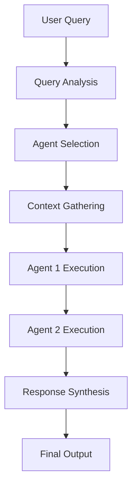
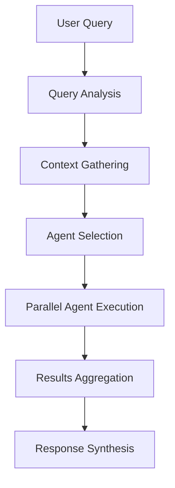

# AI Agent Service Architecture

## Overview

The AI Agent Service is a sophisticated multi-agent orchestration platform that powers intelligent cloud migration assistance through CrewAI workflows and AutoGen conversational agents. Running on port 8008, it provides both deterministic document generation capabilities and interactive AI assistance for complex migration scenarios.

## Tech Stack

### Core Framework
- **FastAPI**: High-performance async web framework for API endpoints
- **Uvicorn**: ASGI server for production deployment
- **Python 3.9+**: Core runtime environment

### AI Agent Frameworks
- **CrewAI**: Multi-agent workflow orchestration for deterministic tasks
- **PyAutoGen**: Conversational multi-agent interactions with human-in-the-loop capabilities
- **LangChain**: LLM integration and prompt management
- **OpenAI/Anthropic/Gemini**: Multiple LLM provider support

### Infrastructure & Storage
- **Redis (DB 4)**: Task status tracking, caching, and message queuing
- **PostgreSQL**: Project metadata and conversation persistence
- **Neo4j**: Knowledge graph operations for agent context
- **WebSockets**: Real-time streaming for agent responses

### Dependencies
```python
fastapi, uvicorn[standard], crewai, pyautogen>=0.2.0
langchain, langchain-openai, langchain-anthropic
redis, psycopg2-binary, neo4j, httpx, websockets
pydantic, python-multipart, requests, pyyaml
```

## Agent Inventory

### CrewAI Workflow Agents

These agents execute structured, deterministic workflows for document generation and analysis tasks.

#### 1. Engagement Analyst (Senior Infrastructure Discovery Analyst)
**Purpose**: Initial project context building through cross-modal knowledge synthesis
**Capabilities**:
- Multi-source data gathering and analysis
- Dependency mapping and application portfolio analysis
- Business-IT alignment assessment
- Pattern recognition across infrastructure components

**Tools Used**: RAG Query, Graph Query, Hybrid Search, Project Knowledge Base
**Backstory**: 12+ years in enterprise IT discovery, specializing in dependency mapping and business-IT alignment

#### 2. Principal Cloud Architect
**Purpose**: Target cloud architecture design and migration strategy development
**Capabilities**:
- Cloud architecture design (AWS/Azure/GCP)
- Migration pattern analysis
- Infrastructure modernization planning
- Cost-benefit analysis for architectural decisions

**Tools Used**: RAG Query, Graph Query, Cloud Catalog, Infrastructure Analysis
**Backstory**: 15+ years leading large-scale cloud migrations across major cloud providers

#### 3. Risk & Compliance Officer
**Purpose**: Comprehensive compliance validation and risk assessment
**Capabilities**:
- Multi-framework compliance analysis (GDPR, SOC2, HIPAA, ISO27001)
- Security risk identification and mitigation
- Regulatory requirement mapping
- Compliance gap analysis

**Tools Used**: RAG Query, Graph Query, Compliance Framework
**Backstory**: Compliance expert with multi-framework experience and enterprise risk management

#### 4. Lead Migration Program Manager
**Purpose**: Synthesis of findings into executive-ready migration plans
**Capabilities**:
- Program governance and stakeholder alignment
- Timeline estimation and resource planning
- Risk mitigation strategy development
- Change management planning

**Tools Used**: RAG Query, Graph Query, Lessons Learned, Project Knowledge Base
**Backstory**: Program manager experienced in governance, stakeholder alignment, and change management

#### 5. Document Researcher
**Purpose**: Information extraction and analysis for document generation support
**Capabilities**:
- Advanced search techniques across multiple data sources
- Information synthesis and pattern identification
- Research foundation building for complex documents
- Knowledge gap identification

**Tools Used**: RAG Query, Graph Query, Hybrid Search, Project Knowledge Base
**Backstory**: 8+ years in information extraction, data analysis, and technical writing

#### 6. Content Architect
**Purpose**: Professional document structure and organization
**Capabilities**:
- Information hierarchy design
- Content flow optimization
- Professional documentation standards
- Audience-appropriate content structuring

**Tools Used**: RAG Query, Graph Query, Document Templates
**Backstory**: 10+ years in document structure, information design, and technical communication

#### 7. Quality Reviewer
**Purpose**: Document quality assurance and validation
**Capabilities**:
- Accuracy and completeness verification
- Consistency checking across documents
- Professional standards compliance
- Quality improvement recommendations

**Tools Used**: RAG Query, Graph Query, Quality Checklists
**Backstory**: 9+ years in technical writing, quality control, and editorial review

#### 8. Post-Processing Agent (Lessons Learned Analyst)
**Purpose**: Knowledge synthesis from document processing results
**Capabilities**:
- Pattern extraction from processing results
- Best practices identification
- Insight generation with confidence scoring
- Sensitive information anonymization

**Tools Used**: Query Insights, Record Insight, Graph Query
**Backstory**: 10+ years in enterprise document analysis and lessons learned capture

### AutoGen Conversational Agents

These agents provide interactive, conversational AI assistance with specialized expertise areas.

#### 1. Migration Architect
**Expertise**: Strategic cloud migration planning and architecture
**Capabilities**:
- AWS/Azure/GCP migration strategies
- Application modernization and containerization
- Infrastructure as Code (Terraform, CloudFormation)
- Database migration and data lake architecture
- Security and compliance during migration

**Response Style**: Strategic guidance with detailed architectural recommendations

#### 2. DevOps Expert
**Expertise**: Infrastructure automation and deployment
**Capabilities**:
- CI/CD pipeline design and implementation
- Kubernetes and container orchestration
- Infrastructure automation and monitoring
- Site reliability engineering (SRE) practices
- Cloud-native application deployment

**Response Style**: Practical implementation guidance with code snippets and automation scripts

#### 3. Security Expert
**Expertise**: Cloud security frameworks and compliance
**Capabilities**:
- Cloud security frameworks (AWS Well-Architected, Azure Security Center)
- Identity and Access Management (IAM) design
- Data encryption and key management
- Compliance standards (SOC 2, GDPR, HIPAA, ISO 27001)
- Security monitoring and incident response

**Response Style**: Security-first recommendations with concrete mitigation strategies

#### 4. Cost Optimizer
**Expertise**: Cloud cost analysis and optimization
**Capabilities**:
- Resource rightsizing and cost analysis
- Reserved instances and savings plans optimization
- Multi-cloud cost comparison and strategy
- FinOps practices and cost governance
- Resource lifecycle management

**Response Style**: Cost-benefit analysis with quantifiable savings projections

#### 5. Data Expert
**Expertise**: Database migration and data platform architecture
**Capabilities**:
- Database migration strategies (rehost, replatform, refactor)
- Data lake and warehouse architecture
- ETL/ELT pipeline design and optimization
- Big data technologies (Spark, Hadoop, streaming)
- Data governance and quality assurance

**Response Style**: Data architecture guidance with performance and governance considerations

#### 6. App Modernization Expert
**Expertise**: Legacy application transformation
**Capabilities**:
- Legacy application assessment and refactoring strategies
- Microservices architecture and API design
- Serverless and event-driven architectures
- Application performance optimization
- Technology stack modernization (containerization, PaaS adoption)

**Response Style**: Transformation guidance with practical modernization patterns

### Agent Processor Task Agents

These are lightweight agents for specific processing tasks within the broader orchestration framework.

#### 1. Analysis Agent
**Purpose**: Document analysis and insight extraction
**Capabilities**: Document processing, pattern recognition, data extraction
**Input Types**: Text, documents
**Output Types**: Structured data, insights

#### 2. Assessment Agent
**Purpose**: Infrastructure and risk assessment
**Capabilities**: Infrastructure analysis, risk evaluation, recommendation generation
**Input Types**: Infrastructure data, documents
**Output Types**: Assessment reports, recommendations

#### 3. Documentation Agent
**Purpose**: Automated document generation
**Capabilities**: Report writing, content formatting, technical communication
**Input Types**: Data, templates
**Output Types**: Documents, reports

#### 4. Migration Planning Agent
**Purpose**: Migration strategy development
**Capabilities**: Dependency analysis, timeline estimation, resource planning
**Input Types**: Infrastructure data, requirements
**Output Types**: Migration plans, timelines

#### 5. Post-Processing Agent
**Purpose**: Knowledge synthesis and lessons learned
**Capabilities**: Insight generation, anonymization, knowledge synthesis
**Input Types**: Processing results, knowledge graph data, document topics
**Output Types**: Best practices, recommendations, knowledge artifacts

## Orchestration Patterns

### Sequential Processing


**Use Cases**: Complex analysis requiring dependent steps, document generation workflows

### Parallel Processing


**Use Cases**: Independent analysis tasks, multi-perspective assessments

### Crew Workflows
Pre-configured multi-agent teams for specific deliverables:

#### Infrastructure Assessment Crew
- **Agents**: Analysis Agent + Assessment Agent
- **Duration**: 15 minutes
- **Deliverables**: Infrastructure assessment report, risk analysis

#### Documentation Crew
- **Agents**: Analysis Agent + Documentation Agent
- **Duration**: 20 minutes
- **Deliverables**: Technical documentation, implementation guides

#### Migration Planning Crew
- **Agents**: Analysis Agent + Assessment Agent + Migration Planner
- **Duration**: 30 minutes
- **Deliverables**: Migration roadmap, timeline, resource requirements

### AutoGen Conversations
Dynamic multi-agent discussions with:
- **Agent Selection**: Query-based automatic agent selection
- **Real-time Streaming**: WebSocket-based response delivery
- **Context Preservation**: Conversation history and session management
- **Fallback Mechanisms**: LLM service integration when AutoGen unavailable

## Integration with Platform Services

### LLM Service (Port 8007)
- **Purpose**: Unified LLM access across multiple providers
- **Integration**: Project-scoped API key management, streaming support
- **Capabilities**: OpenAI, Anthropic, Google Gemini, Ollama support

### Vector Service (Port 8005)
- **Purpose**: Semantic search across vectorized documents
- **Integration**: Collection management, similarity matching, batch processing
- **Capabilities**: Cosine similarity, project-scoped collections

### Graph Service (Port 8006)
- **Purpose**: Knowledge graph traversal and relationship queries
- **Integration**: Node/edge analysis, project isolation, dynamic updates
- **Capabilities**: Cypher queries, entity relationship mapping

### Document Service (Port 8003)
- **Purpose**: Processed document access and metadata
- **Integration**: Content retrieval, metadata access, structured data
- **Capabilities**: Markdown documents, JSONL format, permission controls

### Storage Service (Port 8010)
- **Purpose**: File storage and retrieval
- **Integration**: Direct document access, category management
- **Capabilities**: Streaming downloads, metadata storage

### WebSocket Gateway (Port 8009)
- **Purpose**: Real-time event broadcasting
- **Integration**: Project-scoped events, agent progress updates
- **Capabilities**: Connection pooling, scalable WebSocket management

## Architectural Considerations

### Service Architecture
- **Microservices Design**: Strict service boundaries with HTTP-only communication
- **Bearer Token Authentication**: Service-to-service authentication
- **Health Checks**: Readiness and liveness probes for Kubernetes deployment
- **CORS Configuration**: Development vs production CORS policies

### Agent Management
- **Project-Scoped Configuration**: LLM settings per project
- **Dynamic Agent Loading**: Runtime agent initialization based on availability
- **Fallback Mechanisms**: Graceful degradation when components unavailable
- **Resource Isolation**: Separate Redis databases for different concerns

### Performance & Scalability
- **Async Processing**: Non-blocking agent execution with background tasks
- **Redis Caching**: Task status and intermediate results caching
- **Connection Pooling**: Database connection management
- **WebSocket Optimization**: Efficient real-time communication

### Reliability & Monitoring
- **Structured Logging**: JSON-formatted logs with correlation IDs
- **Error Handling**: Comprehensive exception handling with fallbacks
- **Health Monitoring**: Dependency verification and status reporting
- **Audit Trails**: Complete logging of agent activities and decisions

### Security Considerations
- **Input Validation**: Pydantic models for request validation
- **Authentication**: WebSocket and API authentication
- **Data Sanitization**: Sensitive information handling in responses
- **Access Control**: Project-based data isolation

## API Endpoints

### Agent Management
- `GET /api/agents/available`: List available agents
- `POST /api/agents/{agent_id}/execute`: Execute single agent task
- `GET /api/agents/tasks/{job_id}/status`: Get task status

### Crew Workflows
- `GET /api/crews/available`: List available crews
- `POST /api/crews/{crew_id}/execute`: Execute crew workflow
- `GET /api/crews/workflows/{job_id}/status`: Get workflow status

### AutoGen Conversations
- `POST /api/autogen/discussions/start`: Start new conversation
- `POST /api/autogen/discussions/{session_id}/query`: Continue conversation
- `GET /api/autogen/agents`: List AutoGen agents

### WebSocket Streaming
- `WS /ws/autogen/{session_id}`: Real-time conversation streaming
- `WS /ws/autogen/discussions/{session_id}`: Discussion continuation

## Development & Deployment

### Local Development
- **Port**: 8008
- **Dependencies**: Redis, PostgreSQL, Neo4j
- **Environment**: Development mode with relaxed CORS
- **Auto-reload**: Uvicorn development server

### Production Deployment
- **Containerization**: Docker-based deployment
- **Orchestration**: Kubernetes with health checks
- **Scaling**: Horizontal pod scaling based on load
- **Monitoring**: Structured logging and metrics collection

### Configuration Management
- **Environment Variables**: Service URLs, database connections
- **Config Service Integration**: Centralized configuration
- **Project Scoping**: Per-project LLM and agent configurations

This architecture enables the platform to deliver sophisticated AI assistance while maintaining reliability, scalability, and maintainability across complex cloud migration scenarios.