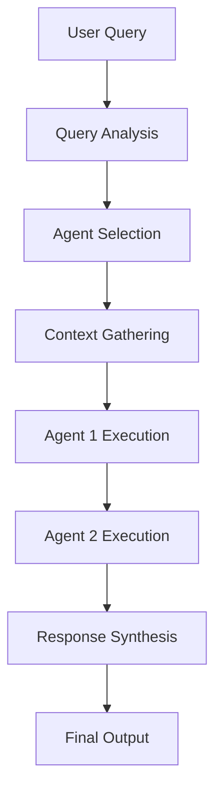
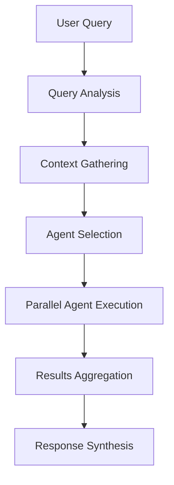

# AI Agent Technologies in the Migration Platform

## 1. Platform Overview

The **Ascent Platform** is Nagarro's comprehensive cloud migration assessment platform, designed to streamline and accelerate cloud migration projects through intelligent document processing, knowledge management, and AI-powered assistance. Built on a sophisticated microservices architecture comprising 17+ specialized services, the platform transforms traditional migration assessments into an AI-driven command center.

### Core Capabilities
- **Document Processing Pipeline**: Automated ingestion, conversion, and analysis of migration-related documents
- **Multi-Modal Knowledge Storage**: Integrated PostgreSQL (metadata), Neo4j (knowledge graphs), Weaviate (vector embeddings), and MinIO (file storage)
- **AI Agent Orchestration**: Advanced multi-agent systems for intelligent query answering and automated document generation
- **LLM Integration**: Provider-agnostic support for OpenAI, Gemini, Anthropic, and Ollama models
- **Project Lifecycle Management**: End-to-end cloud migration project management with real-time collaboration

### Architecture Principles
- **Knowledge-First Design**: All AI capabilities are grounded in processed document data and structured knowledge
- **Hybrid Agentic Model**: Combines deterministic workflows with interactive conversational AI
- **Microservices Isolation**: Strict service boundaries with HTTP-only communication and bearer token authentication
- **Real-Time Communication**: WebSocket-based streaming for live agent interactions and progress updates

## 2. Agentic Technologies Used

The platform employs a sophisticated hybrid agentic architecture that leverages multiple AI agent frameworks to provide both deterministic deliverables and interactive assistance.

### Primary Frameworks

#### CrewAI Framework
- **Purpose**: Orchestrates deterministic, multi-agent workflows for complex deliverables
- **Key Features**:
  - Sequential and parallel agent execution
  - Tool integration for external data access
  - Structured task decomposition and assignment
  - Quality assurance through agent collaboration
- **Use Cases**: Document generation, infrastructure assessments, migration planning

#### Microsoft AutoGen Framework
- **Purpose**: Enables interactive, conversational AI with human-in-the-loop capabilities
- **Key Features**:
  - Multi-agent conversations with natural language interfaces
  - Dynamic agent selection based on query analysis
  - Real-time streaming responses via WebSocket
  - Tool-augmented responses with external knowledge access
- **Use Cases**: Interactive query answering, strategic guidance, real-time assistance

### Supporting Technologies

#### LLM Service Integration
- **Provider-Agnostic Access**: Unified interface to multiple LLM providers
- **Project-Scoped Configurations**: Custom model settings per project
- **Cost Tracking and Optimization**: Token usage monitoring and provider failover
- **Streaming Support**: Real-time response generation for interactive agents

#### Tool Ecosystem
- **RAGQueryTool**: Semantic search across vectorized documents
- **GraphQueryTool**: Knowledge graph traversal and relationship queries
- **HybridSearchTool**: Combined vector and graph search capabilities
- **ProjectKnowledgeBaseTool**: Project-specific knowledge retrieval
- **ComplianceFrameworkTool**: Security and compliance validation
- **InfrastructureAnalysisTool**: Cloud infrastructure assessment

## 3. Types of Agents and Their Purposes

The platform implements multiple categories of AI agents, each specialized for different aspects of cloud migration assistance.

### AutoGen Conversational Agents

| Agent Name | Role | Expertise Areas | Key Responsibilities |
|------------|------|-----------------|---------------------|
| `migration_architect` | Senior Cloud Migration Architect | AWS/Azure/GCP strategies, IaC, database migration, security | Strategic migration planning, architectural recommendations, cost optimization guidance |
| `devops_expert` | DevOps Automation Specialist | CI/CD pipelines, Kubernetes, infrastructure automation, SRE practices | Deployment automation, container orchestration, operational excellence |
| `security_expert` | Cloud Security & Compliance Expert | Cloud security frameworks, IAM design, encryption, compliance standards | Security assessments, compliance validation, risk mitigation strategies |
| `cost_optimizer` | Cloud Cost Optimization Specialist | Resource rightsizing, reserved instances, multi-cloud cost analysis | Cost analysis, optimization recommendations, FinOps guidance |
| `data_expert` | Data Migration & Analytics Expert | Database migration, ETL pipelines, data lakes, big data technologies | Data architecture design, migration strategies, analytics platform planning |
| `app_modernization` | Application Modernization Expert | Legacy app assessment, microservices, serverless, PaaS adoption | Application transformation, technology modernization, development practices |

### CrewAI Workflow Agents

| Agent Name | Role | Primary Function | Tools Used |
|------------|------|------------------|------------|
| `engagement_analyst` | Document Research Specialist | Comprehensive data gathering and analysis | RAG, Graph, Hybrid Search, Project KB |
| `principal_cloud_architect` | Target Architecture Designer | Cloud architecture design and migration patterns | RAG, Graph, Cloud Catalog, Infrastructure Analysis |
| `risk_compliance_officer` | Compliance & Risk Validator | Security and compliance assessment | RAG, Graph, Compliance Framework |
| `lead_planning_manager` | Assessment Report Synthesizer | Executive-ready report generation | RAG, Graph, Lessons Learned, Project KB |

### Agent Processor Task Agents

| Agent Type | Purpose | Capabilities | Output Types |
|------------|---------|--------------|--------------|
| `analysis_agent` | Document analysis and insight extraction | Document processing, pattern recognition, data extraction | Structured data, insights, assessments |
| `assessment_agent` | Infrastructure and risk assessment | Infrastructure analysis, risk evaluation, recommendation generation | Assessment reports, risk analysis, action items |
| `documentation_agent` | Automated document generation | Report writing, content formatting, technical communication | Documents, reports, technical specifications |
| `migration_planner` | Migration strategy development | Dependency analysis, timeline estimation, resource planning | Migration plans, timelines, implementation roadmaps |
| `post_processing_agent` | Knowledge synthesis and lessons learned | Insight generation, anonymization, knowledge synthesis | Best practices, recommendations, knowledge artifacts |

### Multi-Agent Crew Workflows

| Crew Name | Purpose | Participating Agents | Estimated Duration | Key Deliverables |
|-----------|---------|---------------------|-------------------|------------------|
| `infrastructure_assessment_crew` | Complete infrastructure analysis | Analysis Agent + Assessment Agent | 15 minutes | Infrastructure assessment report, risk analysis |
| `documentation_crew` | Comprehensive documentation generation | Analysis Agent + Documentation Agent | 20 minutes | Technical documentation, implementation guides |
| `migration_planning_crew` | End-to-end migration planning | Analysis Agent + Assessment Agent + Migration Planner | 30 minutes | Migration roadmap, timeline, resource requirements |

## 4. Agent Orchestration and Interaction

### AI Agent Service Architecture

The **AI Agent Service** (Port 8008) serves as the central orchestration hub for all agentic activities, providing unified management and execution capabilities.

#### Core Components
- **AutoGen Copilot**: Handles conversational multi-agent interactions
- **Crew Factory**: Creates and manages CrewAI workflow instances
- **Agent Processor**: Manages individual agent tasks and crew workflows
- **WebSocket Integration**: Real-time streaming for agent responses and progress updates

#### Orchestration Patterns

##### Sequential Processing

##### Parallel Processing

#### Interaction Mechanisms

##### WebSocket Streaming
- **Real-time Updates**: Live progress tracking during agent execution
- **Agent Responses**: Incremental delivery of agent outputs
- **Status Notifications**: Task completion and error reporting
- **Connection Management**: Automatic reconnection and session handling

##### Tool Integration
- **Synchronous Calls**: Direct tool execution within agent workflows
- **Asynchronous Processing**: Background tool operations for performance
- **Error Handling**: Graceful degradation when tools are unavailable
- **Caching**: Intelligent result caching to reduce redundant operations

##### Context Management
- **Multi-Source Aggregation**: Combined vector, graph, and document data
- **Relevance Scoring**: Context ranking based on query alignment
- **Memory Management**: Efficient context window handling for LLM interactions
- **Session Persistence**: Conversation history and context retention

## 5. Integration with Platform Services

The agentic system is deeply integrated with the platform's microservices architecture, leveraging specialized services for data access and processing.

### Vector Service Integration (Port 8005)
- **Semantic Search**: Vector embeddings for document content retrieval
- **Collection Management**: Project-scoped vector collections
- **Similarity Matching**: Cosine similarity for relevant content discovery
- **Batch Processing**: Optimized embedding generation and storage

### Graph Service Integration (Port 8006)
- **Knowledge Graph Queries**: Entity relationship traversal
- **Node/Edge Analysis**: Graph pattern matching and discovery
- **Project Isolation**: Scoped graph operations per project
- **Dynamic Updates**: Real-time graph modifications from agent activities

### Document Service Integration (Port 8003)
- **Content Retrieval**: Access to processed markdown documents
- **Metadata Access**: Document processing history and attributes
- **Structured Data**: JSONL format for enhanced entity extraction
- **File Management**: Secure document access with permission controls

### LLM Service Integration (Port 8007)
- **Model Access**: Unified interface to multiple LLM providers
- **Project Configurations**: Custom model settings and parameters
- **Token Management**: Usage tracking and cost optimization
- **Streaming Support**: Real-time response generation capabilities

### Storage Service Integration (Port 8010)
- **File Retrieval**: Direct access to uploaded and processed documents
- **Category Management**: Organized storage with access controls
- **Streaming Downloads**: Efficient large file handling
- **Metadata Storage**: Processing artifacts and analysis results

### WebSocket Gateway Integration (Port 8009)
- **Real-time Broadcasting**: Project-scoped event distribution
- **Agent Progress**: Live updates during agent execution
- **User Notifications**: Interactive feedback and status updates
- **Connection Pooling**: Scalable WebSocket connection management

## 6. Role in Overall Platform Purpose

The agentic technologies form the intelligent core of the Ascent Platform, transforming it from a document processing tool into an AI-powered cloud migration command center.

### Intelligent Query Answering
- **Natural Language Interface**: Users can ask complex migration questions in plain English
- **Multi-Source Reasoning**: Agents combine document knowledge, graph relationships, and vector search results
- **Contextual Responses**: Answers are grounded in actual project data and processed documents
- **Progressive Disclosure**: Responses provide actionable insights with source attribution

### Automated Document Generation
- **Template-Driven Creation**: Agents generate comprehensive migration documents
- **Quality Assurance**: Multi-agent review and validation processes
- **Customization**: Project-specific content adaptation and personalization
- **Format Optimization**: Multiple output formats (Markdown, PDF, DOCX)

### Migration Planning Assistance
- **Strategic Guidance**: High-level architectural and strategic recommendations
- **Risk Assessment**: Automated identification and mitigation of migration risks
- **Cost Optimization**: Intelligent cost analysis and optimization suggestions
- **Timeline Estimation**: Realistic project timeline and milestone planning

### Enhanced User Experience
- **Conversational Interface**: Natural interaction patterns familiar to users
- **Real-Time Feedback**: Live progress updates and agent activity visualization
- **Collaborative Workflows**: Multi-user support with shared agent sessions
- **Learning Adaptation**: Continuous improvement through usage patterns

### Operational Efficiency
- **Scalable Processing**: Background agent execution for large-scale operations
- **Resource Optimization**: Intelligent load balancing and resource allocation
- **Error Recovery**: Automatic retry mechanisms and graceful degradation
- **Audit Trail**: Comprehensive logging of all agent activities and decisions

### Business Impact
- **Accelerated Assessments**: Reduced time from document upload to migration planning
- **Improved Quality**: Consistent, comprehensive analysis and recommendations
- **Cost Reduction**: Optimized migration strategies and resource utilization
- **Risk Mitigation**: Proactive identification of potential migration challenges
- **Knowledge Preservation**: Captured expertise and best practices in agent responses

The agentic technologies enable the platform to deliver on its vision of transforming cloud migration from a manual, document-heavy process into an intelligent, AI-assisted journey that combines human expertise with automated analysis and generation capabilities.